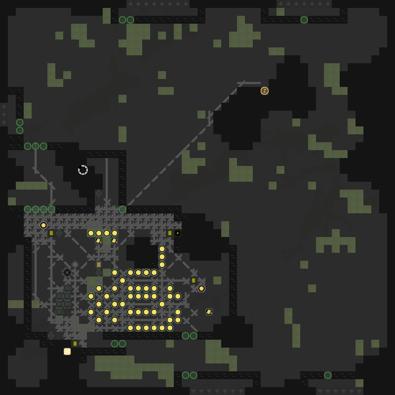

# Screeps-blockVisual
Block style image generator for Screeps room visual.  
Use Screeps' API to get the data of the room.  

For example: 

More functions are being developing, join us if interested! 
(BUGS to be fixed...)

# TODO
- [ ] Connect roads and ramparts  
- [ ] Fix the img of the Room Controller
- [ ] Draw creeps  
- [ ] Fix the baby-size storage/terminal
- [ ] Fix the size of the extensions
- [ ] Add the function to generate worldmaps
